简易操作工具:[公式编辑器](https://www.latexlive.com/)

# 简介

**行内公式**（与文字在同一行）：

```latex
勾股定理：$a^2 + b^2 = c^2$ 是几何学基本定理。
```

勾股定理：  $ a^2+b^2 = c^2$是几何学基本定理。

**独立公式**（单独成行，居中显示）：

```latex
$$
E = mc^2
$$
```

$$
E=mc^2
$$

# 标号

使用`\tag{}`来进行标号

# 基本数学符号

## 操作符

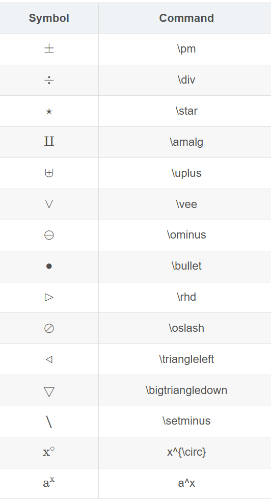

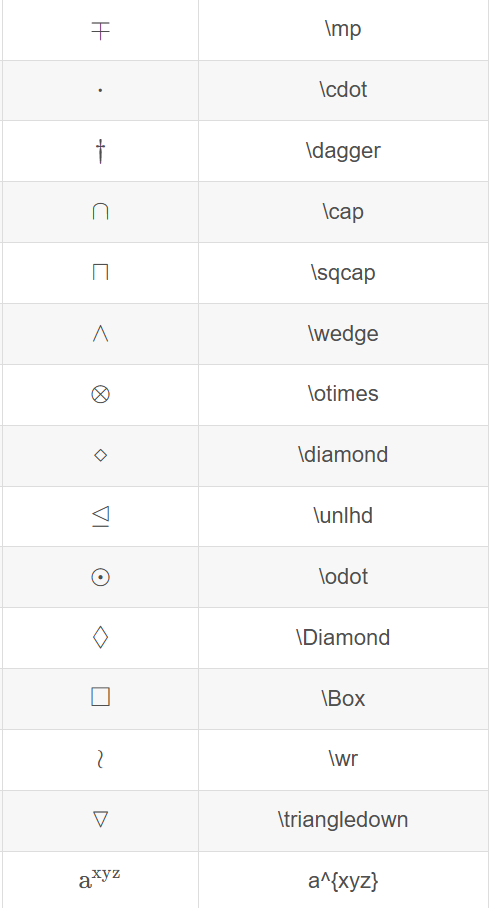

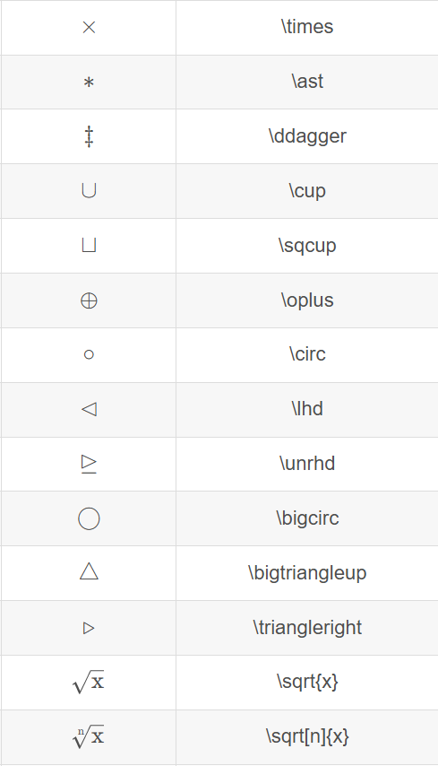

## 关系符

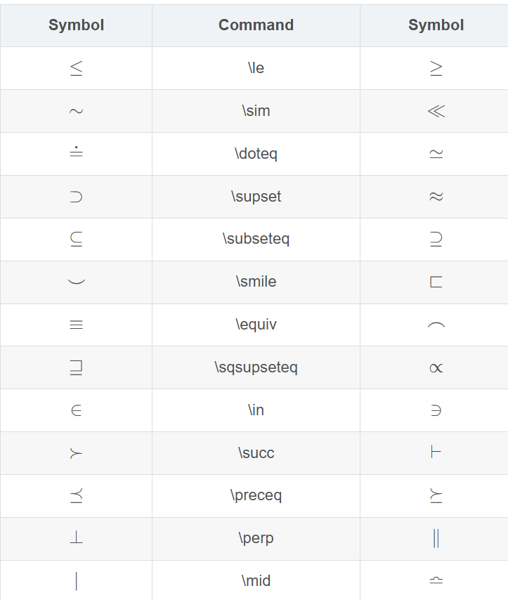

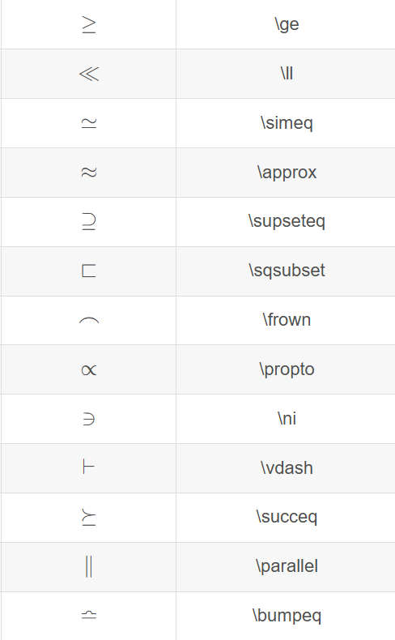

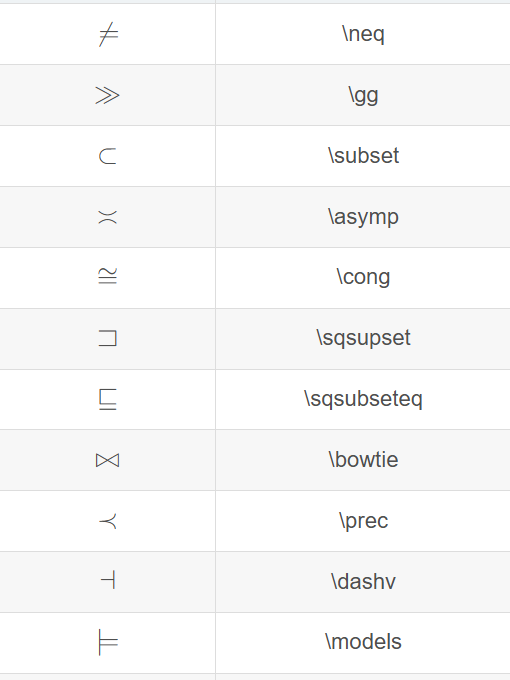

只要将\not放在符号前面或者在 \ 和单词之间插入一个 n ，就可以形成许多这些关系的否定形式

## 希腊字母

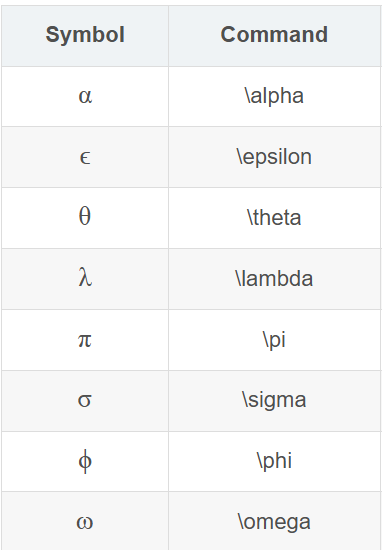

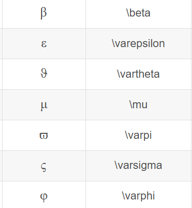

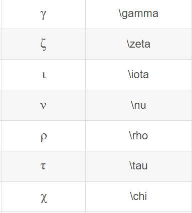

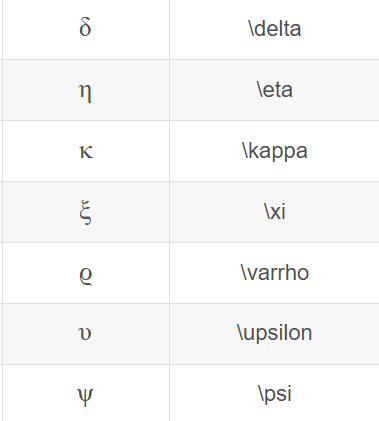

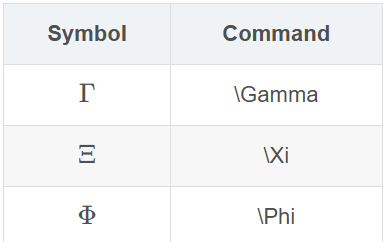

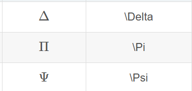

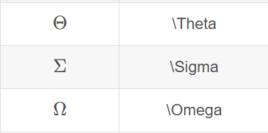

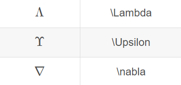

## 加粗

使用\blod加在字母前面

## 箭头

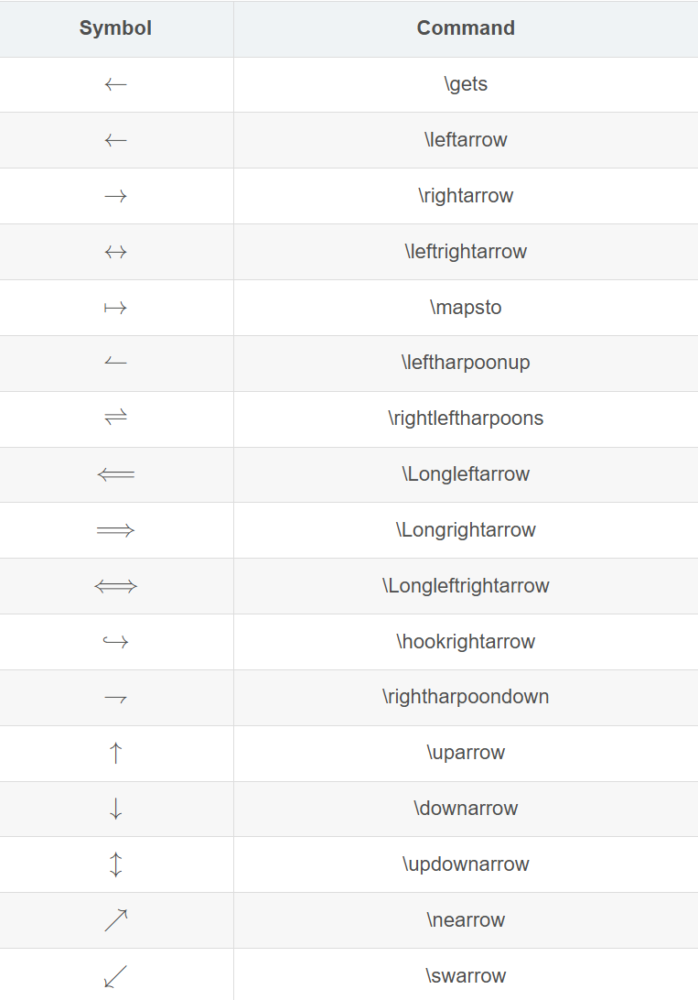

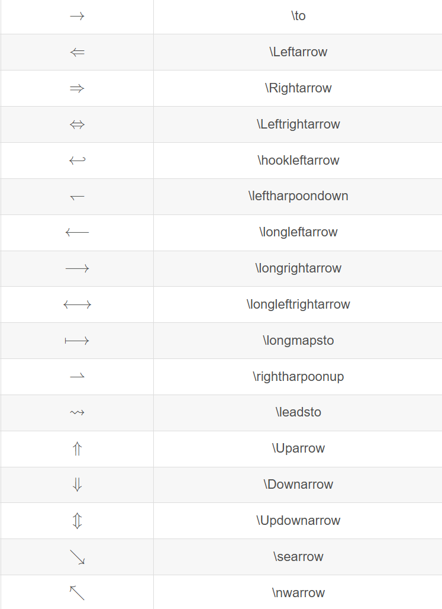

## 上标

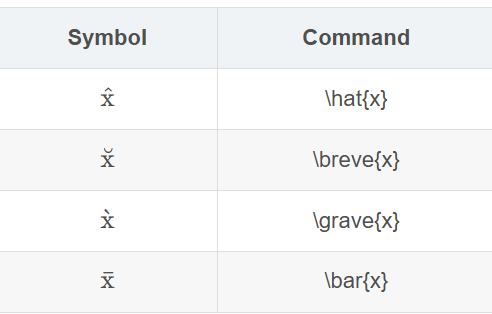

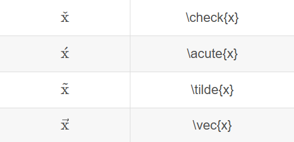

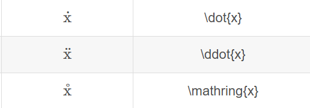

## 跨行符号

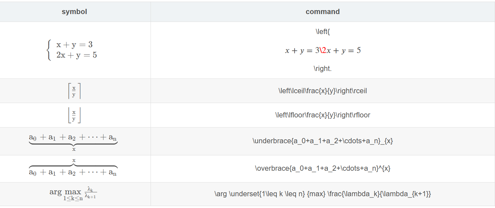

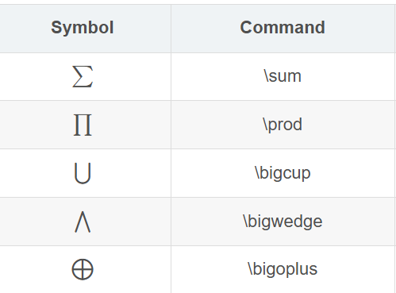

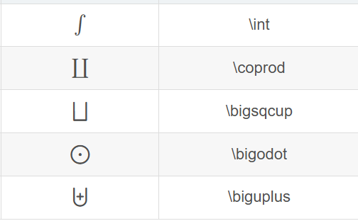

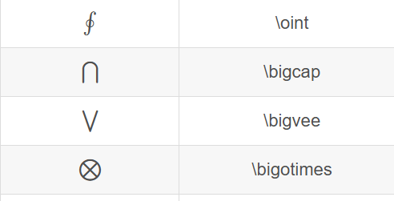
